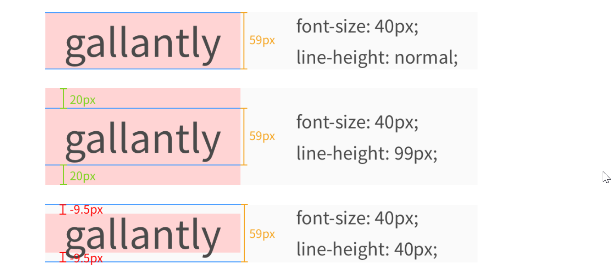
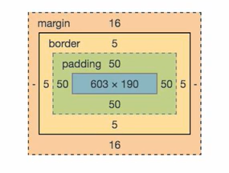

# HTML-CSS

## Tags- frequently use

::: details Click here to see frequently used css example.
```css
// Frequently used style

p {
    font-size: 32px;
    font-weight: 400; //400 is normal, 700 is the same weight of B tag.
    text-align: left; //left, right, center
    text-decoration: underline;//underline, overline, line-through, none; Very useful for a tag. By using 'none', linked text doesn't have underline.
    font-family: "Times new Roman", Times, serif
}


// Using Downloaded Fonts
@font-face {
    src: url("../fonts/BMJUA_otf.otf");//Use downloaded font
    font-family: "jua" //Give a name to this font
    }
p {
    font-family : "jua" // Call the font family named as "Jua"
}
```
:::
JSfiddle

### Jsfiddle
[jsfiddle](https://jsfiddle.net/)
<br>
jefiddle site enables to generate my own coding example with specific address. This address makes it easier to communicte with colleage or post a question in [stck overflow](https://stackoverflow.com/), the most widely used coding community.

I've created a simple html/css code in jsfiddle and geneted my own [link](https://jsfiddle.net/s4kx5boe/) here. By just sharing this link, I can communicate easily with others without sharing all complicated code.

## Applying style - three ways
1. Using `<style>` tag
```html
<style>
  h1 {
    color: green;
    text-align: center;
  }

  p {
    font-size: 18px;
  }
</style>

<h1>Hello World!</h1>
<p>Lorem ipsum dolor sit amet, consectetur adipiscing elit. Quisque sit amet lorem sit amet nunc ornare convallis. 
 Pellentesque ac posuere lectus. In eu ipsum et quam finibus fermentum vitae sit amet magna.</p>
```
2. Style Attribute
```html
<h1 style="color: green; text-align: center;">Hello World!</h1>
<p style="font-size: 18px;">Lorem ipsum dolor sit amet, consectetur adipiscing elit. 
Quisque sit amet lorem sit amet nunc ornare convallis. Pellentesque ac posuere lectus. 
In eu ipsum et quam finibus fermentum vitae sit amet magna.</p>
```
3. External CSS file + `<link>` tag
<br>
*css/styles.css*
```css
h1 {
  color: green;
  text-align: center;
}

p {
  font-size: 18px;
}
```

*index.html*
```
<link href="css/styles.css" rel="stylesheet">

<h1>Hello World!</h1>
<p>Lorem ipsum dolor sit amet, consectetur adipiscing elit. Quisque sit amet lorem sit amet nunc ornare convallis. Pellentesque ac posuere lectus. In eu ipsum et quam finibus fermentum vitae sit amet magna.</p>
```
## Fonts
Tags: font-weight
```css
h1 {
  font-family: "Times New Roman", Times, serif;
} /* No need for double quotes if there's no spaces between words
```
or
```css
@font-face {
  src: url("../fonts/BMJUA_otf.otf");
  font-family: Jua;
}
h1 {
  font-family: Jua
}
```
### Font weight
Only appplied with numbers finished with '00'.
 100, 200, 300, 400, 500, 600, 700, 800, 900

 `font-weight: normal;`is same as `font-weight: 400;`
 ` font-weight: bold;` is same as `font-weight: 700;`

```html
<p id="p1">Hello World!</p>
<p id="p2">Hello World!</p>
<p id="p3">Hello World!</p>
<p id="p4">Hello World!</p>
```
```css
#p1 {
  font-weight: 400;
}

#p2 {
  font-weight: 700;
}

#p3 {
  font-weight: normal;
}

#p4 {
  font-weight: bold;
}
```

### Google Font, Roboto example
```html
<link href="https://fonts.googleapis.com/css?family=Roboto&display=swap" rel="stylesheet">
```
```css
font-family: 'Roboto', sans-serif;
```
### Korean Fonts (or any other languages)
[Korean fonts in Google](https://fonts.google.com/earlyaccess)
<br>
- Ctrl+F in the browser and find with keyword as "Korean".
- In below example, copy only `//fonts.googleapis.com/earlyaccess/jejumyeongjo.css` part and paste in the font link in html.
<br>
>Link 
<br>
@import url(//fonts.googleapis.com/earlyaccess/jejumyeongjo.css);
<br>
Example
<br>
>font-family: 'Jeju Myeongjo', serif;

## line-height

line-height를 사용하면 줄간격을 조절할 수 있습니다. 사실 line-height 속성을 '완벽하게' 이해하려면 타이포그래피 지식이 조금 필요한데요. 우선은 아주 간단하게만 설명드리겠습니다.



위 사진에 파란 줄 보이시죠? 이 파란 줄 사이가 실제 내용이 들어가 있는 'content area'(콘텐츠 영역)입니다.  font-family와 font-size에 따라서 'content area'가 정해지고, line-height는 'content area'에 영향을 주지 않습니다.


line-height를 통해서는 각 줄이 실질적으로 차지하는 공간을 정해줄 수 있습니다. 예를 들어서 99px로 설정하면 'content area'보다 40px이 많기 때문에 위 아래로 20px의 공간이 추가로 생깁니다.


반대로 40px로 설정하면 'content area'보다 19px이 적기 때문에 위 아래로 -9.5px의 공간이 줄어듭니다.


## Image
```html


```
```css
img {
  display: block;
}
```


## Id and Class
What's the difference between id and Class?
id is used to define single element while class is used for defining multiple elements.

Below is the example of using id. id is defined as "favorite-text" element and it's called with '#' in CSS style.

``` html
<p id="favorite-text">First</p>
<p>Second</p>
<p>Third</p>
```
``` css
#favorite-text {
  color: blue;
  font-size: 48px;
}
```
However, class is called with '.' in CSS style.
``` html
<p class="big-blue-text">First</p>
<p>Second</p>
<p class="big-blue-text">Third</p>
```
```css
.big-blue-text {
  color: blue;
  font-size: 48px;
}
```
## Div and Span
One use of div tag is to style specific parts with class or id.
But div tag also has a feacher to move selected sentence or area in the next line. However, by using span tag will solve this issue without this moving feacher.
How this can be explained? That requires understanding of block display and inline display.
## Box Model
CSS basic is explaned as Box Model. 
## Border Margin Padding
* Border

> Basically input tag or some others have defalut border setup. To get rid of those default border, you can set border directly

    * border: none;
    * border: 0;
Examples
```css
<style>
.p1 {
  border: 5px solid red;
  border: 5px dotted blue;
  border: 5px dashed #4d9fff;
}
.p2 {
  border-style: solid;
  border-color: #4d9fff;
  border-width: 5px;
}
.p3 {
  border-top: 5px solid red;
  border-bottom:  8px dashed #4d9fff;
  border-left: 3px dotted blue;
}
```
* Margin
* Padding




```css
<style>
h1 {
  border: 5px solid red;
  width: 500px;
  height: 300px;
}
.p1 {
    border: 5px solid red;
    margin-top: 100px;
    margin-bottom: 100px;
    margin-left: 50px;
    margin-right: 50px;
  } /* or just margin: 50px if 4 vlaues are the same. 
  If top button is the same and left right is the same then, 
  margin 100px 50px*/
.p2 {
    border: 5px solid red;
    margin-bottom: auto;
    margin-right: auto;
  }/* If margin is auto, then left right margin is equal. 
  If not auto, usually the box is alligned to the left as default*/
  .p3 {
    border: 5px solid red;
    padding-top: 50px;
    padding-bottom: 50px;
    padding-left: 50px;
    padding-right: 50px;  
  }
  /* same with padding: 50px 50px 50px 50px or 
  just padding: 50px in case 4 values are the same */
}
```
## Width Height Overflow
* Width
  * min-width
  * max-width
* Height
  * min-height
  * max-height
* Overflow


```css
<style>
h1 {
  border: 5px solid red;
  width: 500px;
  height: 300px;
}
  .p4 {
    border: 5px solid red;
    padding-top: 50px;
    min-width: 300px;
    max-width: 500px;
    min-height: 200px;
    max-height: 300px;
    overflow: hidden;/* hidden, visible, scroll, auto 4 options availabl
    auto and scrool is similar options, but using scroll always display 
    scroll bar regardless of the length of contents*/
  }
}
```
## Border Radius

* border-radius
```css
.div1 {
  border: 1px solid green;
  border-radius: 5px;
  margin-bottom: 20px;
}

.div2 {
  border: 1px solid green;
  border-radius: 30px;
}
```
```css
h1 {
  border: 1px solid green;
  border-top-left-radius: 50px; /* 왼쪽 위 */
  border-top-right-radius: 5px; /* 오른쪽 위 */
  border-bottom-right-radius: 0px; /* 오른쪽 아래 */
  border-bottom-left-radius: 20px; /* 왼쪽 아래 */
}
```
## Background Color/repeat/Position/size
* background-color
```css
h1 {
  background-color: #4d9fff;
}
```
```css
body {
  background-color: #4d9fff;
}

h1 {
  background-color: white;
}

h2 {
  background-color: transparent
}
```

* background-repeat
```css
/* 반복하지 않음 */
background-repeat: no-repeat;

/* 가로 방향으로만 반복 */
background-repeat: repeat-x;

/* 세로 방향으로만 반복 */
background-repeat: repeat-y;

/* 가로와 세로 모두 반복 */
background-repeat: repeat;

/* 반복할 수 있는 만큼 반복한 뒤, 남는 공간은 이미지 간의 여백으로 배분 */
background-repeat: space;

/* 반복할 수 있는 만큼 반복한 뒤, 남는 공간은 이미지 확대를 통해 배분 */
background-repeat: round;
```
```html
<!DOCTYPE html>
<html>
<head>
  <title>background-repeat</title>
  <meta charset="utf-8">
  <link rel="stylesheet" href="css/styles.css">
</head>
<body>

    <div id="div1">
    </div>

    <div id="div2">
    </div>

    <div id="div3">
    </div>

    <div id="div4">
    </div>

    <div id="div5">
    </div>

    <div id="div6">
    </div>

</body>
</html>
```
```css
body {
  background-color: gray;
}

div {
  width: 300px;
  height: 230px;
  border: 2px solid white;
  background-image: url("https://i.imgur.com/WxH5bez.png");
  margin: 30px;
}

#div1 {
  /* 반복하지 않음 */
  background-repeat: no-repeat;
}

#div2 {
  /* 가로 방향으로만 반복 */
  background-repeat: repeat-x;
}

#div3 {
  /* 세로 방향으로만 반복 */
  background-repeat: repeat-y;
}

#div4 {
  /* 가로와 세로 모두 반복 */
  background-repeat: repeat;
}

#div5 {
  /* 반복할 수 있는 만큼 반복한 뒤, 남는 공간은 이미지 간의 여백으로 배분 */
  background-repeat: space;
}

#div6 {
  /* 반복할 수 있는 만큼 반복한 뒤, 남는 공간은 이미지 확대를 통해 배분 */
  background-repeat: round;
}
```
* background-size
```css
/* 원래 이미지 사이즈대로 출력 */
background-size: auto;

/* 화면을 꽉 채우면서, 사진 비율을 유지 */
background-size: cover;

/* 가로, 세로 중 먼저 채워지는 쪽에 맞추어서 출력 */
background-size: contain;

/* 픽셀값 지정 (가로: 30px, 세로: 50px로 설정) */
background-size: 30px 50px;

/* 퍼센트값 지정 (가로: 부모 요소 width의 60%, 세로: 부모 요소 height의 70%로 설정) */
background-size: 60% 70%;
```
* background-position
```css
/* 단어로 지정해주기 (가로: left, center, right, 세로: top, center, bottom) */
/* 아래와 같은 총 9개의 조합이 가능 */
background-position: left top;
background-position: left center;
background-position: left bottom;
background-position: right top;
background-position: right center;
background-position: right bottom;
background-position: center top;
background-position: center center;
background-position: center bottom;

/* 퍼센트로 지정해주기 (가로: 전체 width의 25% 지점, 세로: 전체 height의 75% 지점 ) */
background-position: 25% 75%;

/* 픽셀로 지정하기 (가로: 가장 왼쪽 가장자리에서부터 오른쪽으로 100px 이동한 지점, 세로: 가장 상단 가장자리에서 아래로 200px 이동한 지점) */
background-position: 100px 200px;
```
* [Login page example code](https://jsfiddle.net/oz2kfpt0/)
  * or [Login page full screen](https://bakey.codeit.kr/web/enrollments/5e5cd050cdd0745903c1be41/lessons/621/index.html)

  ## Box Sizing/shadow/blur
* box-sizing
> It's hard to set box sizing as default box size is set as same as content-box, and margin, border, content-box size is to calculated to know box size. Ane all details are to be modified to make the expected box size. From CSS3, box-sizing: border-box; can be stated and width and height can be set as box size.
```css
.div1 {
  box-sizing: border-box;
  border: 10px solid red;
  width: 300px;
  height: 200px;
  margin-bottom: 50px;
}

.div2 {
  box-sizing: border-box;
  border: 10px solid red;
  width: 300px;
  height: 200px;
  padding: 40px;
}
```
*  box-shadow
```css
.div1 {
  background-color: #eeeeee;
  width: 400px;
  height: 300px;
  box-shadow: none;
}
```
```css
.div1 {
  background-color: #eeeeee;
  width: 400px;
  height: 300px;
  box-shadow: 40px 10px 10px 20px #4d9fff;
  /*Shows box shadow spread*/
}
```
* blur : defines blur of the shadow
```css
.div1 {
  background-color: #eeeeee;
  width: 400px;
  height: 300px;
  box-shadow: 40px 10px 10px #4d9fff;
}
```

## Calling multiple layered tags
>>>>>>> origin/master
